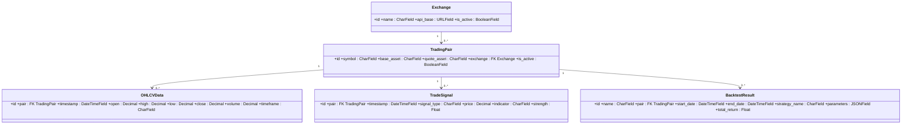

# djangoDashPub — Diagrama de modelos

Inserta este bloque Mermaid en cualquier renderizador (GitHub soporta mermaid en .md si activado) o guarda en un fichero `.mmd`.



Exportar a PNG/SVG (mermaid-cli)
1. Instalar (Node.js requerido):
   - npm install -g @mermaid-js/mermaid-cli
2. Guardar diagrama en `diagram.mmd` y ejecutar:
   - mmdc -i diagram.mmd -o diagram.png
   - mmdc -i diagram.mmd -o diagram.svg

Alternativa rápida sin instalar:
- Usa https://mermaid.live/ para pegar el diagrama y exportar PNG/SVG desde la UI.

Añadir la imagen al README:
```md

```