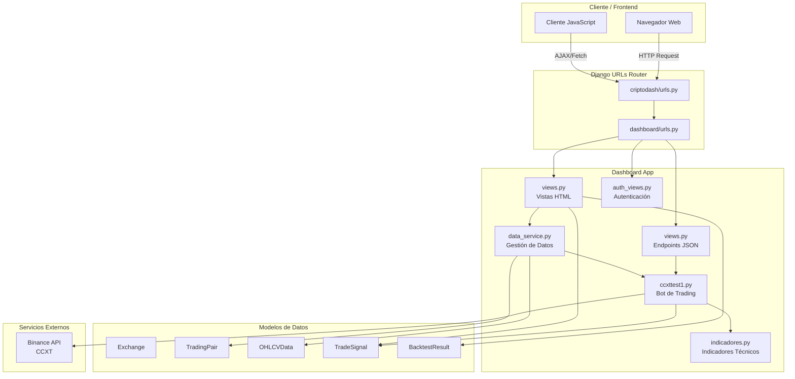
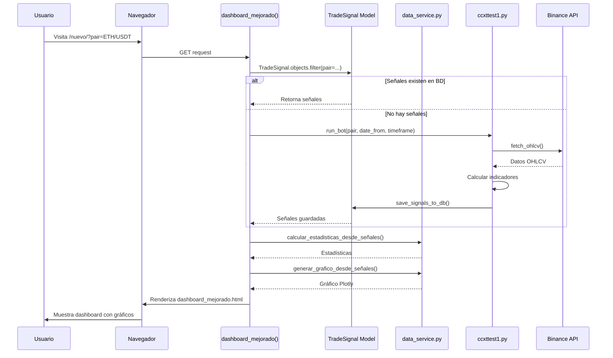
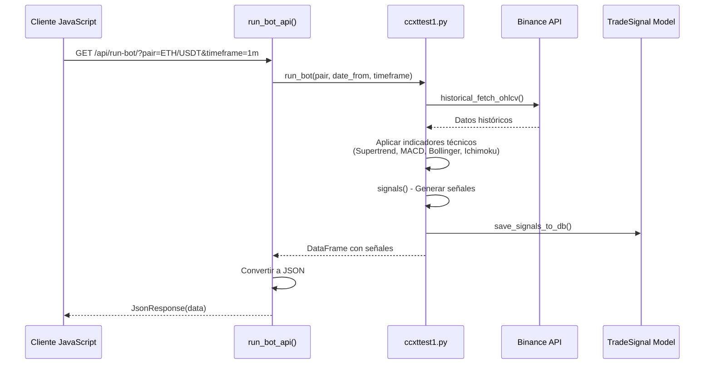
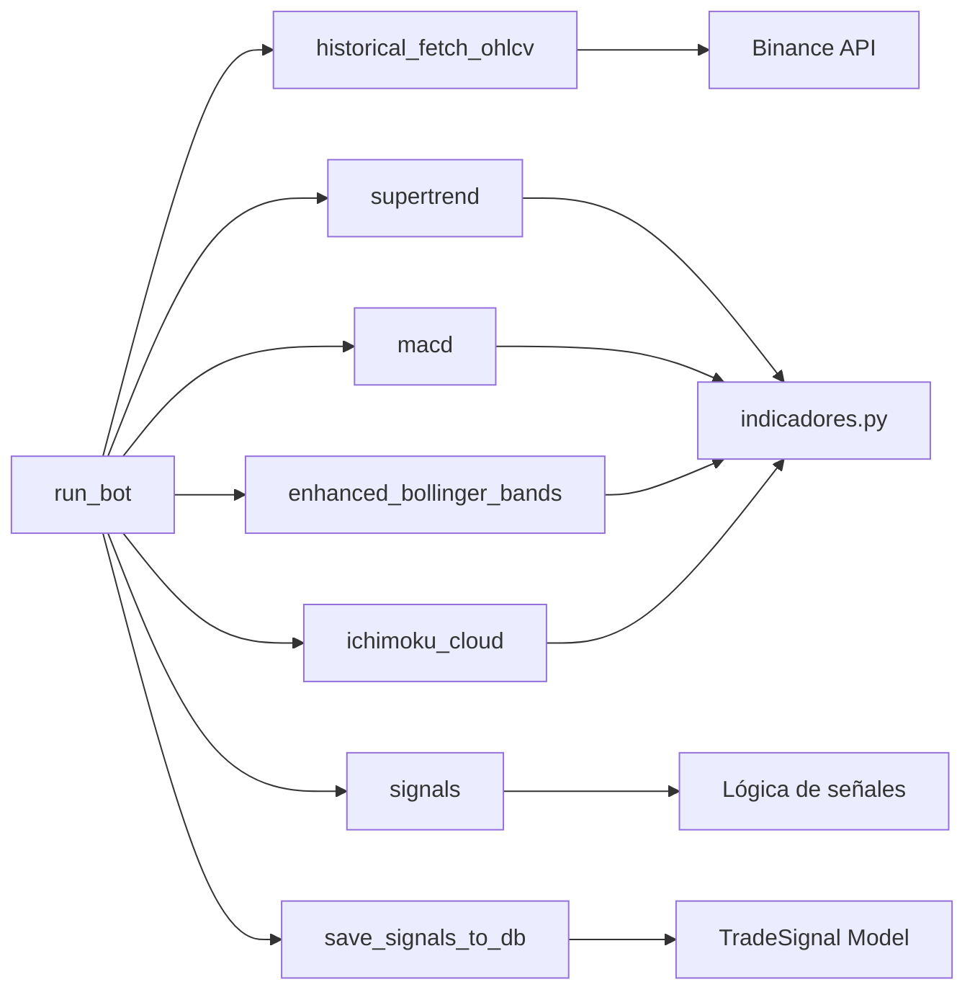

# 📊 Análisis de Código: Relación entre API y Dashboard

## Resumen Ejecutivo

Este proyecto **no tiene una app `api` separada**. En su lugar, los endpoints de API están integrados dentro de la app `dashboard`. La arquitectura combina vistas tradicionales de Django (que renderizan HTML) con endpoints JSON (que funcionan como API) en el mismo módulo.

---

## 🏗️ Arquitectura General


```mermaid
graph TB
    subgraph "Cliente / Frontend"
        Browser[Navegador Web]
        JSClient[Cliente JavaScript]
    end
    
    subgraph "Django URLs Router"
        MainURLs[criptodash/urls.py]
        DashURLs[dashboard/urls.py]
    end
    
    subgraph "Dashboard App"
        Views[views.py<br/>Vistas HTML]
        APIViews[views.py<br/>Endpoints JSON]
        AuthViews[auth_views.py<br/>Autenticación]
        DataService[data_service.py<br/>Gestión de Datos]
        CCXTBot[ccxttest1.py<br/>Bot de Trading]
        Indicators[indicadores.py<br/>Indicadores Técnicos]
    end
    
    subgraph "Modelos de Datos"
        Exchange[Exchange]
        TradingPair[TradingPair]
        OHLCVData[OHLCVData]
        TradeSignal[TradeSignal]
        BacktestResult[BacktestResult]
    end
    
    subgraph "Servicios Externos"
        Binance[Binance API<br/>CCXT]
    end
    
    Browser -->|HTTP Request| MainURLs
    JSClient -->|AJAX/Fetch| MainURLs
    MainURLs --> DashURLs
    DashURLs --> Views
    DashURLs --> APIViews
    DashURLs --> AuthViews
    
    Views --> DataService
    APIViews --> CCXTBot
    DataService --> CCXTBot
    CCXTBot --> Indicators
    
    DataService --> TradingPair
    DataService --> OHLCVData
    CCXTBot --> TradeSignal
    CCXTBot --> Binance
    
    Views --> TradeSignal
    Views --> BacktestResult
```

---

## 📁 Estructura de URLs

### URLs Principales ([criptodash/urls.py](file:///c:/Users/Javier/Desktop/programacion/djangoDashPub/criptodash/criptodash/urls.py))

```python
urlpatterns = [
    path('admin/', admin.site.urls),
    path('accounts/', include('allauth.urls')),  # OAuth y autenticación
    path('', include('dashboard.urls')),          # Todas las rutas del dashboard
    path('django_plotly_dash/', include('django_plotly_dash.urls')),
]
```

### URLs del Dashboard ([dashboard/urls.py](file:///c:/Users/Javier/Desktop/programacion/djangoDashPub/criptodash/dashboard/urls.py))

| Ruta | Vista | Tipo | Descripción |
|------|-------|------|-------------|
| `/` | `views.index` | HTML | Página principal del dashboard |
| `/login/` | `auth_views.custom_login` | HTML | Login de usuarios |
| `/register/` | `auth_views.custom_register` | HTML | Registro de usuarios |
| `/logout/` | `auth_views.custom_logout` | Redirect | Cierre de sesión |
| `/profile/` | `auth_views.profile` | HTML | Perfil del usuario |
| `/technical-analysis/` | `views.technical_analysis` | HTML | Análisis técnico |
| `/run-bot/` | `views.run_bot_view` | HTML | Ejecutar bot (vista) |
| `/import-data/` | `views.import_data` | HTML | Importar datos |
| `/ejecutar-analisis/` | `views.ejecutar_analisis_trading` | HTML | Ejecutar análisis |
| `/nuevo/` | `views.dashboard_mejorado` | HTML | Dashboard mejorado |
| **`/api/run-bot/`** | **`views.run_bot_api`** | **JSON** | **Endpoint API del bot** |
| `/backtest/` | `views.backtest_view` | HTML | Vista de backtesting |

> [!IMPORTANT]
> Solo hay **un endpoint JSON puro** (`/api/run-bot/`). El resto son vistas que renderizan HTML.

---

## 🔄 Flujo de Datos: Dashboard ↔ API

### Flujo 1: Dashboard Mejorado (Vista HTML)


```mermaid
sequenceDiagram
    participant User as Usuario
    participant Browser as Navegador
    participant View as dashboard_mejorado()
    participant Model as TradeSignal Model
    participant DataService as data_service.py
    participant CCXTBot as ccxttest1.py
    participant Binance as Binance API
    
    User->>Browser: Visita /nuevo/?pair=ETH/USDT
    Browser->>View: GET request
    
    View->>Model: TradeSignal.objects.filter(pair=...)
    
    alt Señales existen en BD
        Model-->>View: Retorna señales
    else No hay señales
        View->>CCXTBot: run_bot(pair, date_from, timeframe)
        CCXTBot->>Binance: fetch_ohlcv()
        Binance-->>CCXTBot: Datos OHLCV
        CCXTBot->>CCXTBot: Calcular indicadores
        CCXTBot->>Model: save_signals_to_db()
        Model-->>View: Señales guardadas
    end
    
    View->>DataService: calcular_estadisticas_desde_señales()
    DataService-->>View: Estadísticas
    
    View->>DataService: generar_grafico_desde_señales()
    DataService-->>View: Gráfico Plotly
    
    View->>Browser: Renderiza dashboard_mejorado.html
    Browser->>User: Muestra dashboard con gráficos
```

### Flujo 2: Endpoint API JSON


```mermaid
sequenceDiagram
    participant JSClient as Cliente JavaScript
    participant API as run_bot_api()
    participant CCXTBot as ccxttest1.py
    participant Binance as Binance API
    participant Model as TradeSignal Model
    
    JSClient->>API: GET /api/run-bot/?pair=ETH/USDT&timeframe=1m
    
    API->>CCXTBot: run_bot(pair, date_from, timeframe)
    CCXTBot->>Binance: historical_fetch_ohlcv()
    Binance-->>CCXTBot: Datos históricos
    
    CCXTBot->>CCXTBot: Aplicar indicadores técnicos<br/>(Supertrend, MACD, Bollinger, Ichimoku)
    CCXTBot->>CCXTBot: signals() - Generar señales
    CCXTBot->>Model: save_signals_to_db()
    
    CCXTBot-->>API: DataFrame con señales
    API->>API: Convertir a JSON
    API-->>JSClient: JsonResponse(data)
```

---

## 🧩 Componentes Principales

### 1. [views.py](file:///c:/Users/Javier/Desktop/programacion/djangoDashPub/criptodash/dashboard/views.py) - Controlador Principal

#### Vistas HTML (Renderizan Templates)

| Función | Líneas | Descripción |
|---------|--------|-------------|
| `index()` | 378-381 | Página principal |
| `technical_analysis()` | 382-387 | Análisis técnico con Plotly Dash |
| `dashboard_mejorado()` | 431-500 | Dashboard principal con señales y gráficos |
| `ejecutar_analisis_trading()` | 23-43 | Ejecuta análisis y muestra resultados |
| `backtest_view()` | 894-949 | Vista de backtesting |

#### Endpoints JSON (API)

| Función | Líneas | Descripción |
|---------|--------|-------------|
| **`run_bot_api()`** | **862-892** | **Endpoint JSON que ejecuta el bot y retorna datos** |

**Código de `run_bot_api()`:**

```python
def run_bot_api(request):
    pair = request.GET.get('pair', 'ETH/USDT')
    date_from = request.GET.get('date_from')
    timeframe = request.GET.get('timeframe', '1m')

    try:
        result = ccxttest1.run_bot(pair=pair, date_from=date_from, timeframe=timeframe)
        
        # Normalizar salida a lista de dicts
        if hasattr(result, "to_dict"):
            data = result.to_dict('records')
        elif isinstance(result, list):
            data = result
        else:
            df = pd.DataFrame(result)
            data = df.to_dict('records')

        return JsonResponse(data, safe=isinstance(data, dict))
    except Exception as e:
        return JsonResponse({'error': str(e)}, status=500)
```

---

### 2. [ccxttest1.py](file:///c:/Users/Javier/Desktop/programacion/djangoDashPub/criptodash/dashboard/ccxttest1.py) - Bot de Trading

#### Funciones Principales


```mermaid
graph LR
    A[run_bot] --> B[historical_fetch_ohlcv]
    A --> C[supertrend]
    A --> D[macd]
    A --> E[enhanced_bollinger_bands]
    A --> F[ichimoku_cloud]
    A --> G[signals]
    A --> H[save_signals_to_db]
    
    B --> I[Binance API]
    C --> J[indicadores.py]
    D --> J
    E --> J
    F --> J
    G --> K[Lógica de señales]
    H --> L[TradeSignal Model]
```

| Función | Líneas | Descripción |
|---------|--------|-------------|
| `run_bot()` | 190-225 | Función principal que orquesta todo el proceso |
| `historical_fetch_ohlcv()` | 176-187 | Obtiene datos históricos de Binance |
| `save_signals_to_db()` | 227-289 | Guarda señales en la base de datos |
| `signals()` | 109-146 | Genera señales de compra/venta |
| `check_buy_sell_signals()` | 83-107 | Verifica señales de trading |

**Flujo de `run_bot()`:**

```python
def run_bot(pair, date_from, timeframe):
    # 1. Obtener datos históricos
    bars = historical_fetch_ohlcv(pair, date_from, timeframe)
    df = pd.DataFrame(bars[:-1], columns=['timestamp', 'open', 'high', 'low', 'close', 'volume'])
    
    # 2. Calcular indicadores técnicos
    supertrend_data = supertrend(df)
    macd_data = macd(supertrend_data)
    boll = enhanced_bollinger_bands(macd_data, window=20, num_std=2, strategy='all')
    ichi = ichimoku_cloud(boll)
    
    # 3. Generar señales
    sig = signals(ichi)
    
    # 4. Guardar en base de datos
    save_signals_to_db(sig, pair)
    
    return sig
```

---

### 3. [data_service.py](file:///c:/Users/Javier/Desktop/programacion/djangoDashPub/criptodash/dashboard/data_service.py) - Gestión de Datos

#### Clase DataManager

```python
class DataManager:
    def fetch_ohlcv_from_exchange(pair_symbol, timeframe='1m', since=None, limit=1000)
        # Llama a historical_fetch_ohlcv de ccxttest1
        
    def get_ohlcv_from_db(pair_obj, timeframe='1m', start=None, end=None)
        # Recupera datos de OHLCVData
        
    def save_ohlcv_rows(df, pair_obj, timeframe='1m', batch_size=500)
        # Guarda datos en BD
        
    def get_or_fetch(pair_symbol, timeframe='1m', start=None, end=None, limit=1000)
        # Intenta BD primero, luego exchange
```

#### Funciones de Análisis

| Función | Descripción |
|---------|-------------|
| `calcular_estadisticas_desde_señales()` | Calcula métricas de trading |
| `generar_grafico_desde_señales()` | Genera gráficos Plotly |

---

### 4. [indicadores.py](file:///c:/Users/Javier/Desktop/programacion/djangoDashPub/criptodash/dashboard/indicadores.py) - Indicadores Técnicos

Biblioteca completa de indicadores técnicos:

| Indicador | Función | Líneas |
|-----------|---------|--------|
| True Range | `tr()` | 22-30 |
| ATR | `atr()` | 37-41 |
| RSI | `calculate_rsi()` | 68-82 |
| Supertrend | `supertrend()` | 92-115 |
| MACD | `macd()` | 131-137 |
| Bollinger Bands | `bollinger_bands()` | 154-197 |
| Ichimoku Cloud | `ichimoku_cloud()` | 374-400 |
| Donchian Channels | `donchian_channels()` | 516-519 |

---

### 5. [models.py](file:///c:/Users/Javier/Desktop/programacion/djangoDashPub/criptodash/dashboard/models.py) - Modelos de Datos

```mermaid
erDiagram
    Exchange ||--o{ TradingPair : has
    TradingPair ||--o{ OHLCVData : has
    TradingPair ||--o{ TradeSignal : has
    TradingPair ||--o{ BacktestResult : has
    Pair ||--o{ TradeSignal : "references (new)"
    
    Exchange {
        string name
        url api_base
        bool is_active
    }
    
    TradingPair {
        string symbol
        string base_asset
        string quote_asset
        FK exchange
        bool is_active
    }
    
    OHLCVData {
        FK pair
        datetime timestamp
        decimal open
        decimal high
        decimal low
        decimal close
        decimal volume
        string timeframe
        float rsi
        float macd
    }
    
    TradeSignal {
        FK pair
        FK pair_ref
        datetime timestamp
        string signal_type
        decimal price
        string indicator
        float strength
        json indicators
    }
    
    BacktestResult {
        string name
        FK pair
        datetime start_date
        datetime end_date
        string strategy_name
        json parameters
        float total_return
        float sharpe_ratio
    }
    
    Pair {
        string symbol
        string base_asset
        string quote_asset
        string pair_type
        string exchange
    }
```

---

## 🔗 Relaciones Clave entre Funciones

### Relación 1: Dashboard → Bot → Indicadores → Base de Datos

```
dashboard_mejorado()
    ↓
ccxttest1.run_bot()
    ↓
historical_fetch_ohlcv() → Binance API
    ↓
indicadores.supertrend()
indicadores.macd()
indicadores.bollinger_bands()
indicadores.ichimoku_cloud()
    ↓
signals() → Genera señales
    ↓
save_signals_to_db() → TradeSignal Model
    ↓
Base de Datos MySQL
```

### Relación 2: API Endpoint → Bot → JSON Response

```
Cliente JavaScript
    ↓
GET /api/run-bot/?pair=ETH/USDT
    ↓
run_bot_api()
    ↓
ccxttest1.run_bot()
    ↓
[mismo flujo que arriba]
    ↓
JsonResponse(data)
    ↓
Cliente JavaScript recibe JSON
```

### Relación 3: DataService como Intermediario

```
dashboard_mejorado()
    ↓
data_service.calcular_estadisticas_desde_señales()
    ↓
TradeSignal.objects.filter()
    ↓
Cálculos estadísticos
    ↓
Retorna dict con stats
```

---

## 📊 Tabla de Dependencias entre Módulos

| Módulo | Depende de | Es usado por |
|--------|------------|--------------|
| `views.py` | `ccxttest1`, `data_service`, `models` | URLs, Templates |
| `ccxttest1.py` | `indicadores`, `models`, `ccxt` | `views`, `data_service` |
| `data_service.py` | `ccxttest1`, `models` | `views` |
| `indicadores.py` | `pandas`, `numpy` | `ccxttest1` |
| `models.py` | Django ORM | Todos los módulos |
| `auth_views.py` | Django auth, `allauth` | URLs |

---

## 🎯 Puntos Clave de Integración

### 1. **No hay separación API/Dashboard**
   - Todo está en la app `dashboard`
   - Solo un endpoint JSON: `/api/run-bot/`
   - El resto son vistas HTML tradicionales

### 2. **Flujo de Datos Bidireccional**
   - **Dashboard → BD**: Guarda señales calculadas
   - **BD → Dashboard**: Lee señales para mostrar
   - **API → Cliente**: Retorna JSON con señales

### 3. **Reutilización de Código**
   - `ccxttest1.run_bot()` es usado por:
     - `run_bot_api()` (endpoint JSON)
     - `dashboard_mejorado()` (vista HTML)
     - `ejecutar_analisis_trading()` (vista HTML)

### 4. **Capa de Abstracción**
   - `data_service.py` actúa como intermediario
   - Separa lógica de negocio de presentación
   - Facilita testing y mantenimiento

---

## 🔍 Ejemplo Completo de Flujo

### Escenario: Usuario visita el dashboard mejorado

1. **Usuario** navega a `/nuevo/?pair=ETH/USDT&fecha_inicio=2025-01-01`

2. **Django Router** dirige a `dashboard_mejorado(request)`

3. **Vista** intenta obtener señales de BD:
   ```python
   señales = TradeSignal.objects.filter(pair=pair).order_by('-timestamp')
   ```

4. **Si no hay señales**, ejecuta el bot:
   ```python
   ccxttest1.run_bot(pair='ETH/USDT', date_from='2025-01-01', timeframe='1m')
   ```

5. **Bot** obtiene datos de Binance:
   ```python
   bars = historical_fetch_ohlcv('ETH/USDT', '2025-01-01', '1m')
   ```

6. **Bot** calcula indicadores:
   ```python
   df → supertrend() → macd() → bollinger_bands() → ichimoku_cloud() → signals()
   ```

7. **Bot** guarda señales:
   ```python
   save_signals_to_db(sig, 'ETH/USDT')
   ```

8. **Vista** calcula estadísticas:
   ```python
   stats = calcular_estadisticas_desde_señales(señales)
   ```

9. **Vista** genera gráfico:
   ```python
   grafico = generar_grafico_desde_señales(señales, 'ETH/USDT')
   ```

10. **Vista** renderiza template:
    ```python
    return render(request, 'dashboard/dashboard_mejorado.html', context)
    ```

11. **Usuario** ve el dashboard con gráficos interactivos

---

## 💡 Conclusiones

### Arquitectura Actual

✅ **Ventajas:**
- Código centralizado en una sola app
- Fácil de entender y mantener
- Reutilización efectiva de funciones
- Buena separación de responsabilidades (views, services, models)

⚠️ **Consideraciones:**
- Solo un endpoint JSON real
- Mezcla de vistas HTML y API en el mismo archivo
- Podría beneficiarse de Django REST Framework para APIs más robustas

### Recomendaciones

Si se necesita expandir la funcionalidad API:

1. **Crear app `api` separada** con Django REST Framework
2. **Mover `run_bot_api()` y crear serializers**
3. **Mantener `dashboard` solo para vistas HTML**
4. **Compartir lógica de negocio** a través de `data_service.py`

---

**Documento generado**: 2025-12-02  
**Proyecto**: CriptoDash - Django Cryptocurrency Trading Dashboard
