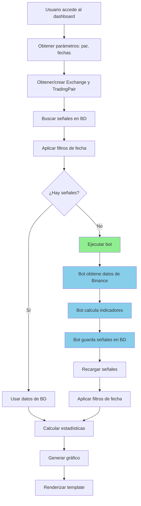

# 🔧 Correcciones Aplicadas: dashboard_mejorado

## Resumen de Cambios

Se corrigieron múltiples problemas en la vista `dashboard_mejorado` que impedían la correcta obtención y visualización de datos cuando no existían en la base de datos.

---

## ✅ Problemas Corregidos

### 1. Error de Atributo en `data_service.py`

**Archivo**: [data_service.py:164](file:///c:/Users/Javier/Desktop/programacion/djangoDashPub/criptodash/dashboard/data_service.py#L164)

**Problema**: La función usaba `signal_strength` pero el modelo `TradeSignal` define el campo como `strength`

**Antes**:
```python
fuerza_promedio = sum(s.signal_strength for s in señales_list) / total_señales
```

**Después**:
```python
fuerza_promedio = sum(s.strength for s in señales_list) / total_señales
```

---

### 2. Lógica Incompleta en `dashboard_mejorado()`

**Archivo**: [views.py:431-500](file:///c:/Users/Javier/Desktop/programacion/djangoDashPub/criptodash/dashboard/views.py#L431-L541)

#### Problemas Anteriores:

1. ❌ Solo ejecutaba el bot si `TradingPair.DoesNotExist`
2. ❌ No verificaba si había señales después del filtrado por fechas
3. ❌ Variables podían quedar indefinidas si había errores
4. ❌ Falta de manejo de errores robusto
5. ❌ No informaba al usuario sobre la fuente de datos

#### Solución Implementada:

✅ **Flujo mejorado**:



---

## 📝 Cambios Detallados

### Inicialización de Variables

**Nuevo código**:
```python
# Inicializar variables para evitar errores
señales = TradeSignal.objects.none()
pair = None
error_message = None
fuente_datos = 'Base de datos local'
```

**Beneficio**: Previene errores de variables indefinidas

---

### Creación Automática de Par

**Antes**: Fallaba con `TradingPair.DoesNotExist`

**Ahora**:
```python
# Obtener o crear TradingPair
pair, pair_created = TradingPair.objects.get_or_create(
    symbol=pair_symbol,
    exchange=exchange,
    defaults={
        'base_asset': pair_symbol.split('/')[0],
        'quote_asset': pair_symbol.split('/')[1] if '/' in pair_symbol else ''
    }
)

if pair_created:
    print(f"Nuevo par creado: {pair_symbol}")
```

**Beneficio**: Crea automáticamente el par si no existe

---

### Verificación de Señales Vacías

**Nueva lógica**:
```python
# Contar señales después del filtrado
señales_count = señales.count()
print(f"Señales encontradas después del filtrado: {señales_count}")

if señales_count == 0:
    print("No hay señales, ejecutando bot...")
    # Ejecutar bot automáticamente
```

**Beneficio**: Ejecuta el bot cuando no hay datos para el rango de fechas

---

### Formato de Fecha para CCXT

**Nuevo código**:
```python
# Formatear fecha para ccxt (ISO 8601)
if fecha_inicio:
    date_from_str = fecha_inicio + ' 00:00:00'
else:
    # Si no hay fecha de inicio, usar últimos 7 días
    date_from_str = (datetime.now() - timedelta(days=7)).strftime('%Y-%m-%d %H:%M:%S')

print(f"Ejecutando bot con date_from={date_from_str}")
```

**Beneficio**: Convierte correctamente el formato de fecha para la API de Binance

---

### Manejo de Errores Mejorado

**Nuevo código**:
```python
try:
    # Ejecutar bot
    ccxttest1.run_bot(pair=pair_symbol, date_from=date_from_str, timeframe='1m')
    
    # Recargar señales
    señales = TradeSignal.objects.filter(pair=pair).order_by('-timestamp')
    
    # Aplicar filtros de fecha nuevamente
    if fecha_inicio_dt:
        señales = señales.filter(timestamp__gte=fecha_inicio_dt)
    if fecha_fin_dt:
        señales = señales.filter(timestamp__lt=fecha_fin_dt)
    
    fuente_datos = 'Binance API (recién obtenido)'
    print(f"Señales después de ejecutar bot: {señales.count()}")
        
except Exception as e:
    error_message = f"Error al ejecutar el bot: {str(e)}"
    print(error_message)
    import traceback
    traceback.print_exc()
```

**Beneficio**: Captura y registra errores detallados sin romper la aplicación

---

### Protección contra Errores en Estadísticas

**Nuevo código**:
```python
try:
    stats = calcular_estadisticas_desde_señales(señales)
    grafico = generar_grafico_desde_señales(señales, pair_symbol)
except Exception as e:
    print(f"Error al calcular estadísticas o gráfico: {e}")
    # Valores por defecto si falla
    stats = {
        'total_señales': 0,
        'compras': 0,
        'ventas': 0,
        'fuerza_promedio': 0,
        'precio_promedio': 0,
        'fecha_primera_señal': None,
        'fecha_ultima_señal': None,
    }
    grafico = None
```

**Beneficio**: Siempre retorna un contexto válido al template

---

### Información de Fuente de Datos

**Nuevo en contexto**:
```python
context = {
    # ... otros campos ...
    'fuente_datos': fuente_datos,  # 'Base de datos local' o 'Binance API (recién obtenido)'
    'error_message': error_message,  # Mensajes de error si los hay
}
```

**Beneficio**: El usuario sabe de dónde vienen los datos

---

## 🧪 Cómo Probar

### Caso 1: Par con Datos Existentes

**URL**: `/nuevo/?pair=ETH/USDT`

**Resultado esperado**:
- ✅ Muestra señales de la base de datos
- ✅ No ejecuta el bot
- ✅ `fuente_datos = 'Base de datos local'`
- ✅ Consola muestra: `"Señales encontradas después del filtrado: X"`

---

### Caso 2: Par sin Datos en Rango de Fechas

**URL**: `/nuevo/?pair=ETH/USDT&fecha_inicio=2025-01-01&fecha_fin=2025-01-02`

**Resultado esperado**:
- ✅ No encuentra señales en BD
- ✅ Ejecuta el bot automáticamente
- ✅ Obtiene datos de Binance
- ✅ Guarda señales en BD
- ✅ Muestra gráfico con nuevas señales
- ✅ `fuente_datos = 'Binance API (recién obtenido)'`

**Logs esperados en consola**:
```
ejecutando dashboard_mejorado
Par seleccionado: ETH/USDT, Fecha inicio: 2025-01-01, Fecha fin: 2025-01-02
Filtro aplicado: fecha_inicio >= 2025-01-01 00:00:00-03:00
Filtro aplicado: fecha_fin < 2025-01-03 00:00:00-03:00
Señales encontradas después del filtrado: 0
No hay señales, ejecutando bot...
Ejecutando bot con date_from=2025-01-01 00:00:00
[Logs del bot...]
Bot ejecutado exitosamente, recargando señales...
Señales después de ejecutar bot: X
```

---

### Caso 3: Par Nuevo (No Existe en BD)

**URL**: `/nuevo/?pair=BTC/USDT&fecha_inicio=2025-11-01`

**Resultado esperado**:
- ✅ Crea `Exchange` si no existe
- ✅ Crea `TradingPair` automáticamente
- ✅ Ejecuta el bot
- ✅ Guarda señales
- ✅ Muestra gráfico

**Logs esperados**:
```
Nuevo par creado: BTC/USDT
Señales encontradas después del filtrado: 0
No hay señales, ejecutando bot...
```

---

### Caso 4: Sin Fechas Especificadas

**URL**: `/nuevo/?pair=ETH/USDT`

**Resultado esperado**:
- ✅ Muestra todas las señales del par
- ✅ Si no hay señales, ejecuta bot con últimos 7 días

**Logs si no hay datos**:
```
Señales encontradas después del filtrado: 0
No hay señales, ejecutando bot...
Ejecutando bot con date_from=2025-11-25 11:15:00
```

---

### Caso 5: Fecha Inválida

**URL**: `/nuevo/?pair=ETH/USDT&fecha_inicio=fecha-invalida`

**Resultado esperado**:
- ✅ Muestra mensaje de error
- ✅ No ejecuta el bot
- ✅ `error_message = 'Formato de fecha inicio inválido: fecha-invalida'`

---

## 📊 Verificación en Base de Datos

Después de ejecutar el bot, verifica que se guardaron las señales:

```sql
-- Ver señales guardadas
SELECT 
    ts.timestamp,
    ts.signal_type,
    ts.price,
    ts.strength,
    tp.symbol
FROM dashboard_tradesignal ts
JOIN dashboard_tradingpair tp ON ts.pair_id = tp.id
WHERE tp.symbol = 'ETH/USDT'
ORDER BY ts.timestamp DESC
LIMIT 10;
```

---

## ⚠️ Consideraciones Importantes

### Límites de API de Binance

> [!WARNING]
> El bot ahora se ejecuta automáticamente cuando no hay datos. Esto puede resultar en:
> - Múltiples llamadas a la API de Binance
> - Posible alcance de límites de rate limiting
> - Tiempo de espera mientras se obtienen datos

**Recomendación**: Considerar implementar caché o limitar la frecuencia de ejecución del bot.

---

### Formato de Fechas

> [!IMPORTANT]
> El formato esperado es `YYYY-MM-DD` (ej: `2025-01-15`)
> 
> Internamente se convierte a:
> - Django: `2025-01-15 00:00:00-03:00` (timezone aware)
> - CCXT: `2025-01-15 00:00:00` (ISO 8601)

---

### Mensajes de Error

El template debe mostrar `error_message` si existe:

```django

<div class="alert alert-danger">
    {{ error_message }}
</div>

```

---

## 🎯 Próximos Pasos Sugeridos

1. **Agregar indicador de carga**: Mostrar spinner mientras el bot se ejecuta
2. **Implementar caché**: Evitar llamadas repetidas a Binance
3. **Agregar validación de fechas en frontend**: Prevenir envío de fechas inválidas
4. **Limitar rango de fechas**: Evitar solicitudes de datos muy antiguos
5. **Agregar paginación**: Para cuando hay muchas señales

---

## 📁 Archivos Modificados

1. [data_service.py](file:///c:/Users/Javier/Desktop/programacion/djangoDashPub/criptodash/dashboard/data_service.py#L164) - Línea 164
2. [views.py](file:///c:/Users/Javier/Desktop/programacion/djangoDashPub/criptodash/dashboard/views.py#L431-L541) - Líneas 431-541

---

**Fecha de implementación**: 2025-12-02  
**Estado**: ✅ Completado
